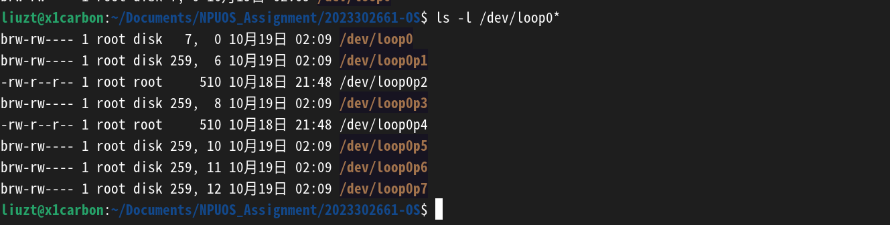

# 关于Lab3中make出错的原因

## Intro

在**Lab3**中，助教为我们提供了更为完备的**make**工具，从创建镜像到运行qemu，都只需要加上对应的参数，为我们提供了极大的便利。  

但是我在这次实验中，却发现make工具似乎在我的机器上有严重的“**水土不服**”，在涉及**image**与**mount**上一直报错，根本无法自动化运行，只好手动操作，但越往后的步骤越繁琐，手动的效率太低，必须得看看**这究竟怎么个事**。  

事实上，试点班群里的**@朱诚昊**同学在lab3刚推送时就在群中提出了此问题，与助教讨论后暂时得到了**重启**的解决方法。后面我在做的时候遇到的问题与其**完全一致**，并且再深入发现**重启**并非最终的解决方法，环设备爆掉也非真实的原因，因此记录在此。  

## 问题表现

我的设备信息：  
  

在使用make工具自动构建image时，会显示如下图的报错信息：  
  

也就是说无法正常挂载我们实验所需的**loop0p2**与**loop0p4**，导致make这一执行流无法实现。  

具体的，应该是执行到这里时出了错：  
  

## 手动模拟

### 问题复现

手动完成前面的所有步骤，包括创建磁盘、磁盘分区、分区初始化，一直到出错的这里，来看看究竟发生了什么。  
（在手动完成上面这些步骤中，在分区初始化时，loop0p1、loop0p2、loop0p4可能会提示`mkfs.vfat: Attempting to create a too small or a too large filesystem`与`mkfs.vfat: Not enough or too many clusters for filesystem - try less or more sectors per cluster`，这里重启电脑再尝试，是能够解决p2与p4的，但是p1可能的确是分配的太小以至不能够初始化。但是实验只用到p2与p4，所以无妨；**事实上这里重启的作用是删除占位的僵尸文件p2与p4，从而能够成功手动操作，直到下一次make，见下面的分析**）  

#### 烧写boot.bin

执行`sudo dd if=build/boot/boot.bin of=/dev/loop0p2 bs=1 count=420 seek=90`，没有什么异常，显示写入成功，说明boot没有问题。（**但是真的如此吗？请继续往下**）  
  

#### 挂载并烧录loader.bin、kernel.bin

尝试挂载，却报错，提示**不是可用的块设备**：  
  

因此无法挂载，更不用提写入文件了。  

#### 验证boot是否写入

用**xxd**查看img文件，会发现上面明明**成功写入**的boot代码并未出现在预期位置。  
结合**不是可用的块设备**，可知其虽写入成功，但并非写入到需要的地方。  

### 探究原因

从**不是可用的块设备**出发，用`ls -l /dev/loop0p2`来看，其结果是`-rw-r--r-- 1 root root 510 10月18日 21:48 /dev/loop0p2`，其的确不是一个**块设备**（会以b为开头），而只是一个普通文件。  

但是用`ls -l /dev/loop0*`来查看的话，诡异的是只有**loop0p2**与**loop0p4**不是块设备，或许是初始化时出了某些问题？但是尝试重新建立一个新的image，并将其分区后立刻再执行，结果是同样的：  
  

看时间戳，发现p2与p4并不是刚才新建立的，更像是之前阴差阳错挂载过、没有清理所导致的。  
再解除losetup后其也仍然存在：  
  

手动删除后，再次losetup、查看：  
  
这次就全部正常了，再尝试**mount**等命令，一切正常。  

所以，**无法mount**的原因是之前的某种操作使得**/dev/loop0p2**与**/dev/loop0p4**挂载为了普通文件，并且没能成功解除挂载，导致其相当于一个**占位符**。后面再次losetup时，尽管系统会自动**解析分区表**并**创建分区块设备**，可p2与p4冲突，无处可去，只能让给占位的普通文件，进而导致后续的写入、挂载失败。  

而手动删除这两个普通文件，就能在**手工构建**中解决这一问题。  

## 推广至make

那么这一方法放到make会好吗？  
——结果是**不会好**，甚至证明了这一异常就是**make image**产生的：  
  

但是我手动模拟时却没有这一系列事情啊……  

于是再仔细研究，发现了端倪：在**make-image.sh**脚本的第18行，`sfdisk $image_file < part.sfdisk > /dev/null 2>&1`这一命令所用的sfdisk工具，是无法在普通用户下生效的，必须得在sudo下。这就与lab2中Makefile的mkfs命令一样，不加sudo，就会引起异常行为。  

修改后，执行，十分的完美，没有bug了：  
  

那么我猜测，就是因为这里**没能分区成功**，导致后面所有的操作都会报错，只是错误重定向了，看不到；而真正的主角**loop0p2**和**loop0p4**还需要挂载，尽管**不存在**，但在这过程中**可能会强行创建**，所以会有这两个分区的普通文件在占位；而**sudo losetup -d /dev/loop0**本身就没有p2和p4，所以在最后查看时产生了“*p2与p4被挂载为普通文件且出现异常无法解除挂载*”的错误判断。  

## GPT瞎扯的bug产生原因与的确可行的解决方案

***以上是正常的解决此bug的思路，最后能够合理的解决此bug；但我是先问的GPT，其给了我一个基于幻觉的解释，但解决方案却负负得正，现在回想起来感觉有趣，也记在这里***  

当我第一次使用**make image**并失败后，并未着手于解决此bug，而是以为这是**共性错误**（因为群里问的问题和我一样），想着学长不久后肯定会发解决方法，那么我先**手动**往下做着就行，所以自己按照脚本写起来——这里本该就意识到是没有加sudo的，可惜没有，观察不仔细……  
（**注意此时，从上面的bug产生原因我们知道make失败后就已经建立起了占位的p2与p4**）  

然后继续往下操作，到**手动初始化**各分区时，实在是一直不成功，这时想到群里提到的**重启**，就试了一下，果然能够继续手动初始化了，那么**make img**呢？试了一下，却依旧失败，那么还是继续手动吧。  
（**这一过程中，就是通过重启删除了僵尸loop0p2/4，重启后就能够手动初始化了；但又跟了一次make，导致僵尸loop0p又出现**）  

接下来就是编写mbr.asm、烧写mbr.bin，但因为mbr是直接写到img的，不涉及分区，所以平安无事。  

这样一直到让**mbr加载boot**，由于boot是要写在分区的开头，所以就涉及到操作分区，也就是在这里试了半天都不成，于是让GPT帮我分析。  
（**这是因为都写到僵尸loop0p2里了，并没能写到我的实际磁盘**）  

其给的原因是：一般当我们用**losetup**命令时，其会自动**解析分区**并创建对应的**分区设备节点**，但在某些发行版（尤其是新版 Ubuntu22.04+ / Debian12+）中，这个功能需要**kpartx**支持，否则创建的是假的“文件节点”，不能直接 mount（注意以上纯为幻觉导致的胡扯，后来我反应过来后追问，其就给了一堆假数据），具体的操作是每当**losetup**后，要用`sudo kpartx -av /dev/loop0`把image给重新解析、映射到**/dev/mapper/loop0p\***处，我试了试，还真的管用。  
（**因为我手动实现的磁盘img是没问题的，只是挂载分区是被僵尸挤占，用这个重新解析到mapper路径下，没有挤占，自然可行，但是原因根本不是其说的那样**）  

就这样，我用这个**负负得正**的方法一直把实验做到**修改boot.asm**，为了方便构建，想重新研究一下make，这才一下下发现真正的错误原因。  