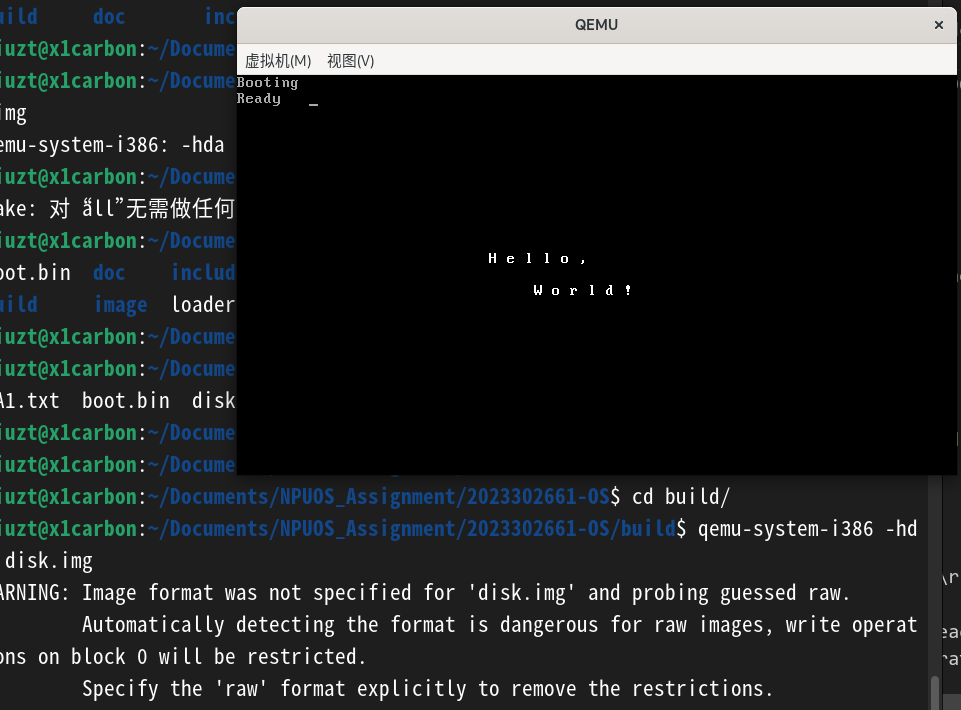
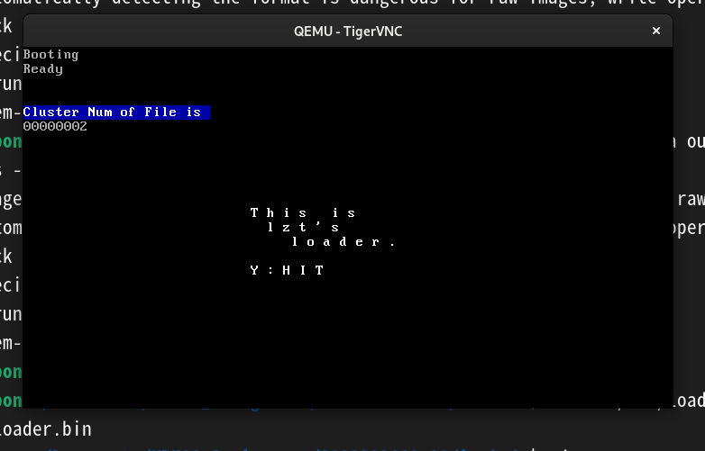
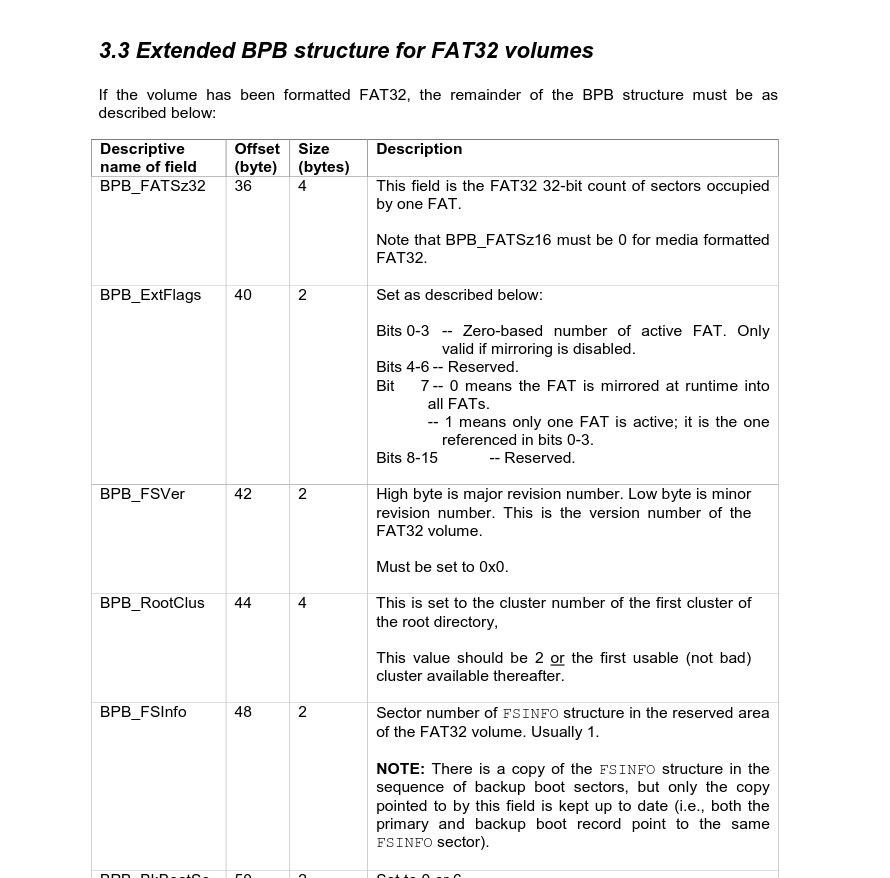
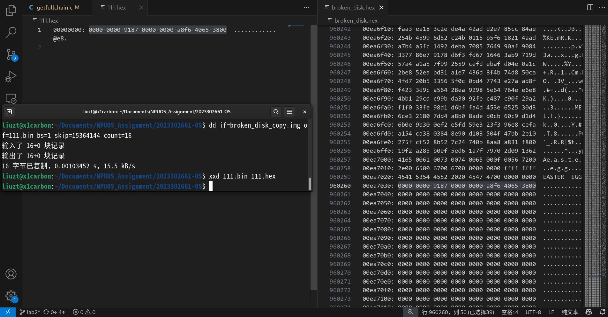
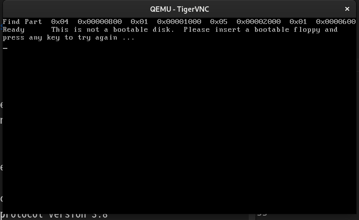

实验记录

# Lab1

## 环境的配置

在开始**Lab1**之前，需要根据**实验环境说明书**配置出一套符合要求的环境。  
本来以为这就和配置网课的xv6一样**简单**，无非是另外安装qemu的x86库就行，**但是**安装时却出了问题，RISC-V的工具链要**被强制删除**，原因是xv6依赖的**risc-v编译器**与本实验需要的**32位程序编译器**冲突，可以认为是它们各自用到的gcc12版本不一样（是两个变体）。  

搜索了一下，最好的解决办法就是将两个环境**隔离**起来，并且使用**docker**会更方便。之前一直听说docker的好处，但没有遇到过必须用其解决的情况，所以正好趁此机会大体的了解了一下docker，并用它构建一个满足本实验编译的环境来练手，具体的描述[记在了这里]()。  

后面尝试用boot启动虚拟机时，发现需要用到**GUI**，但是容器里没有图形化界面，再装一个有点不值；再看了一下xv6的实现并不需要用到图形界面，所以就重新弄了一下，把xv6的RISC-V编译链搬到docker里（具体操作放到那边的文档），本课的实验放在**宿主机**上就好。  

## boot.asm

TODO完成起来没有很难，主要是**看文档**比较费事，先是在**int 10**里面找了半天能够显示字符串的分类，找到后又继续研究里面各个寄存器是用来干什么的。  
好在确定是**int 10**中断的**AH=13h**类型后，就能确定**实验指导**给的表的意思了，因此完成起来不难，对照着填寄存器的值就行。最后的效果：  
  

### 求甚解

尽管基本任务完成了，但还是有些地方其实一无所知。需要弄懂。  

#### org

刚开始的`org 0x7c00`命令，后面的地址是约定的boot程序起始段（BIOS会把引导程序读到此位置，所以实际执行时是以此地址为起始的），但前面的命令在ppt给的常见命令中没见到。  

**org**即**origin**，作用是改变**汇编器**内部的地址计算方式，并不会生成机器码。  
也就是汇编器默认代码的起始内存是0，但实际上是0x7c00，如果不提示汇编器这一点，其在执行**跳转**等命令时就会算错偏移量。  

#### 标签

代码一共有两个标签，分别是**DispStr**与**BootMessage**，那为什么一个就能包括代码段，一个就只是定义了一个字符串？  

标签本身只是一个**地址符号**，记录了其所在的这一行的位置，并没有包括或不包括后面的代码。之所以两个标签的效果不同，是因为**DispStr**是被**call**使用的，会跳转到其位置运行，直到读到**ret**返回；但是**BootMessage**只是被当作一个数据地址。  

#### times   510-($-$$) db 0

这里没有看懂，只知道注释里写的是填充区域的。  

（此时整个扇区可以认为是一个“段”）  
+ `times <count> db <value>`指令的作用是重复执行`db <value>`count次
+ `$`表示当前的**汇编位置**，其起始点会受**org**命令的影响
+ `$$`表示当前**段的起始位置**，默认是0，但会受**org**的影响改变

所以`$-$$`得到的就是**段内偏移量**，在本例中是得到从第一条实际执行的指令开始到当前位置的字节数。  

在此之上，写成`510-....`就能刚好将扇区剩余空间补0补到510字节，配合后面的两字节结束码，**凑齐512B**，符合**BIOS的引导规范**。  
（那两字节的**0xaa55**也属于是**早期约定规范**，叫做**引导扇区签名**，BIOS在512B的最后读到这两个字节，才会认定是一个符合要求的boot程序）  

#### 最后两行永远跑不到

确实如此，从**程序运行**角度看，的确到不了；  
但是**程序本身也是数据**，虽然跑不到，但是其作为数据被BIOS检查时这里就会用到。  

#### 为何页数改动看不见、为何文字显示在第一行的一半

以上两个问题是对于中断要求的相关寄存器配置。  

页数对应的是bh寄存器，为0时能看到，其他时看不到，是因为启动时候只有这么一页；  
文字显示是默认跟着光标走，这说明光标位置初始不在此。可以通过别的中断来设置（好像也是后面的任务）  

### 总结流程

电脑启动，固件中的bios程序开始执行，首先对硬件进行自检，然后检测启动盘（在qemu中的-driven参数），并按下面顺序：把启动盘一共512B的数据放到内存的0x7c00处，再检查最后的2字节是否符合要求，符合就从0x7c000处按照此boot程序加载系统，否则换下一个启动盘尝试。  

## 滚动窗口

清屏这一需求，自然是提到的**06h**中断，其能够把选中的窗口整体上移（或直接清空）。  

描述是这么简单，但是**实现起来有点晕**：这一整屏幕，怎么算行、怎么算列？  

询问了一下GPT，答案是**绝大多数 BIOS 默认启动进入的就是 80 列 × 25 行文本模式**，其他模式还可以通过别的中断设置。  

这样就能继续了。  

***

# Lab2

Lab2一上来就似乎有点上强度了，看的晕晕乎乎。  

## 先运行起来

既然看不懂，那就先把默认的运行起来再说。  
跟着指导书后面的流程，进行**disk.img**的构建：  
+ 系统没有**mkfs**命令，查找可知其在某些对应的包里，通过`sudo apt install util-linux dosfstools`安装，可是显示已经安装；那么可能就是在root用户下了，查看了一下，果然。  
+ 指导书中给定了“不安全”的挂载方式，是到**/mnt**，并在提示中说明了Makefile中给定了更安全的方式，那就是创建一个临时目录并挂载到其上。  

最后把按照教程制作好的**disk.img**挂载并运行，却发现连“Hello,World!"都没有输出，而是乱码：  
  

可能是我的操作细节不对？那就用给定的**Makefile**进行make，来看看能出来不。  

但是却报了错，在82行、错误127，这意味着**命令未找到**，定位到82行语句为`	@mkfs.vfat -F 32 -s 8 $@ > /dev/null 2>&1`，果然是因为我这里只有root才有mkfs的相关命令。所以在开头加上一个**sudo**，这样就好了。  

用qemu挂载这个新镜像，竟然出现了正确的效果：  
  

看来的确是自己手操的步骤里哪里不规范。  
不过教程里确实都一直提到只是一个概念，具体的、安全的一些方式都能在Makefile中找到，那就先这样，后面做起来再结合Makefile看看正确的做法都是什么。  

## 任务1

### 单引号的表示

步骤1中的第1条，是一个照猫画虎的更改，在**loader.asm**里观察，发现**WriteChar**就类似一个函数，接收行号、列号与要显示的字符（见下一条）。  

在编排`This is lzt's loader.`时，对“**'**”这一符号犯难，试图将其用转义符，构建时会报错。经过一番查找，得知用**ASCLL码**(39or0x27)或者**双引号包围**("'")即可，nasm并不支持转义符的这种风格。  

#### marco 宏

在**loader.asm**中，创建了一个名为**WriteChar**的宏，可以理解为是一个宏函数。  

然后了解一下具体的语法，就是通过`%marco`与`%endmarco`包裹，然后是**宏名+参数数量**，以及具体实现，就是一个编译期间自动进行的文本替换。  

### 手动写入纠错

这一步骤是必须要手动写入，那么就不用make了，要搞明白为什么自己手动写入的不行。  

先尝试用**diff**命令分析一下不同两种方式得到的文件不同之处，但是其对于**.img**这种二进制文件，只能输出是否相同，却不能输出哪里不同。查找资料，得知可以用**xxd**命令来将二进制文件转为十六进制文件，就可以使用diff了。  

于是分别把手动写入与make自动构造出的的**disk.img**转成**mydisk.img**与**makedisk.img**，再用diff分析，但输出的结果没有办法看，没有规律、数量巨大。  

于是只好在**vsCode**中打开，手动分析一下两文件的差异：  
  

在开头处，左侧为自己手动编译的，右侧为make编译出来的，很容易发现两边在翻译成“**LOADER BINBooting……**”后都是一致的，但是前面这里不同，左边像是直接覆盖了某些字段，导致发生了一定的错位，一直到0x200。根据翻译出的字段**.X.mkfs.fat**以及手册中提到的“*实际上由于 fat32 在第一个扇区保留了 fs 的元信息，故 boot.bin 的写入位置和写入大小应当稍作调整以避免覆盖了 fs 的相关信息。*”，所以这就跟着手册定位到了原因，应该就是这一块有部分被直接覆盖，导致qemu识别硬盘不顺利。  

但是这个**fs元信息**是什么东西，为何这么重要，能导致qemu无法正常识别？  
查找资料，得知**fs元信息**就是在**mkfs**格式化磁盘/镜像时生成的信息，包括分块、创建超级块（文件系统基本参数）、初始化块位图、初始化根目录等，相当于**mkfs**构成了磁盘的**骨架**，而**元信息**就是**骨架的说明书**。这里被损坏后就无法正常识别。  

> 此外，还发现在0x4000、0x8000等位置（也就是16384=2^14=16KB）有标记，经过分析，应该是一个**簇**的起始标志，而根据手册可知共有16MB、32768个扇区，每扇区512B，那么**一个簇就对应32个扇区**。可是在定义时定义的-s是8啊？可能是两个文件不同？先mark住（）
> 但是不理解为什么手动写入与make生成的在接下来的几行有不同之处，猜测这是跟着内存变化的。
>   
>   

那么这就意味着找到不占用的写入方法，就能保留这些元信息了，这也就是手册中提到的思路。  
新创建一个空白的磁盘，查看其中的内容：  
```
dd if=/dev/zero of=empty.img bs=1024 count=16384
sudo mkfs.vfat -F 32 -s 8 empty.img
xxd empty.img > empty.hex
```

对比刚建立的文件系统与makedisk，发现似乎后者不同的地方是从0x60开始的，并且在0x40行就出现了不同的地方：  
  
并且发现在前面的簇起始区内容也不一样，三种各有各的样子：  
  
看不出来，那么继续，先把loader写入进来，观看前后变化。  

写入loader后，再转成新的hex文件，这次可以直接用diff来比较：`diff empty.hex empty2.hex`，可见前面起始区没有很大的变化，loader的确是写到了后面；然后有略微的变化，应该是文件系统自动进行的修改。  
  

那么观察**empty2.hex**与**makedisk.hex**，就可以看出来其是将boot写入到了0x5A之后的区域，就能够不影响fs元数据了。但是还有0x43后的4个字节也发生了变化，猜测这也是文件系统做的。  

那么接下来就研究一下如何让**dd**命令精确的在指定位置写入，查找资料，可以知道dd命令的几个参数用法：  
+ **bs=大小**：设置读写的块大小，单位是byte，这里需要精确操作，就设置为1
+ **seek=n**：在写入前跳过输出文件的n个块
+ **skip=n**：在读取时跳过n个块
+ **count=n**：指定复制的块数  
+ 还可以在bash下结合`$(())`算术拓展使用**十六进制数**

使用指令`dd if=boot.bin of=empty.img bs=1 seek=$((0x59)) count=512 conv=notrunc注意这里这个是错的要得是0x5A`，将boot的数据写进，这次应该差不多了。（事实上，看下面也知道并没有，出了一个小bug）  

直接挂载到qemu运行，却弹出窗口、报了错，显示`eadFailN`，这时也不能用diff分析，因为实际上make还增加了一个文本文件（后面任务要用到），会直接占满屏幕，这会继续肉眼分析前面这一部分即可。  

肉眼观察对比，发现是少偏移一个byte，但是明明要在**0x5A**之后写入，我放到**跳过0x59**不是正好吗？  
思考了一下，发现这就是经典的**索引**与**个数**的问题，从小到大，从年份到数组，总被这东西坑。的确我们是要**跳过0x59**，但这是**索引**，从0开始；而seek需要的是**数量**，从1开始，因此需要索引到0x59，那么数量就得是0x60。  

这样再来一遍，终于，成功了，手动！  
  

这时再参考**Makefile**中的做法：`	@dd if=$(BOOT_FILE) of=$@ bs=1 count=420 seek=90 conv=notrunc > /dev/null 2>&1`，这里大体是一样的，只是count数量不同，我的是512，但这里是420。  
但实际上，命令执行后的输出是
```
输入了 420+0 块记录
输出了 420+0 块记录
420 字节已复制，0.00678099 s，61.9 kB/s
```
这为什么就是420呢？发现是从**90字节**开始，加上**420字节**为**510字节**，再加上最后的**2字节**的签名，刚好凑够boot所需要的**512字节**。  

所以猜测这**420字节**刚好是整个**boot程序**的大小，难道真这么细节吗？并且最后的的签名为何在boot.asm中找到定义呢？  
这里就涉及到**boot.asm**文件了，在这里面大概看了一下，果然最后的`times   SizeOfBoot - ($-$$) db 0`填充命令中，sizeOfBoot是一个**512-90-2**，所以**boot.asm**会自动填充到这个值。  
至于最后的签名没有在boot中找到，其实是因为这在**mkfs.vfat**时候就创造好了。  

所以，这**420字节**就是第一扇区留给**boot**程序的实际空间。那么，为什么**fs元数据**就能在**90字节**前呢？因为实际上看刚创建好的文件系统，90字节前后明明都有相关数据，而且前面那次失败也说明少一字节都不行，这具体肯定有规定，所以到手册中给定的官方文档中看看。  

具体内容从文档**第7页**开始，大致介绍了**BPB结构**（可以理解成所谓的fs元数据？），其中就提到**0-35字节**是FAT文件**通用的**基本元数据定义区域，然后剩余区域则是**拓展区域**，大小和FAT格式有关，譬如**FAT12/16**最多到61字节，而对于**FAT32**则到了89字节，并且定义了最后的签名，如图：  
  

那么这下这个**90字节**就明白了，这时再看看十六进制文件在90字节左右翻译出的：  
```
  FAT32   ...w|.
".t.V.......^..2
.......This is n
ot a bootable di
sk.  Please inse
rt a bootable fl
oppy and..press 
any key to try a
gain ... .......
```
我猜测这里就是当一个磁盘的这个初始扇区没有boot，也就意味着这些字没有被覆盖，那么bios显示的时候就会把这些字符串显示出来，来起到提示作用。  

***综上，终于比较清晰的理解了如何自己手动写入、为什么会错、怎样才不会错，而不是仅仅调用make程序，分析对比hex也很~~有趣~~。***  

总之是把这第一个任务完成了！  

## 任务2

### 像boot一样寻找loader.bin

先看懂**boot.asm**是如何寻找loader.bin的，相关代码应该是**.find_loader**处的。  

一条一条看，把语法先搞懂，后面可以调试。  
+ **push**：把寄存器/立即数压入栈，实际上就是栈指针往下移，**SP=SP-2**，然后把数据写到**SS:SP**对应的内存处
+ **repe**：该指令是“*Repeat while Equal*”的意思，要与串指令一起用。这里的`repe cmpsb`是常见搭配，会先设置**CX**为计数器，然后比较**DS:SI**与**ES:DI**字节，如果相同，就继续比较下一个并**CX-1**，直到不同或者CX为0，此时**ZF=1**；如果不同就退出，设置**ZF=0**。所以这通常用于**比较两字符串是否相等**。
+ **jz**：与上面联动，意为*jump if Zero*，如果**ZF=1**则跳转，否则继续往下走。

大概道理懂了，但是**为什么loader要找loader.bin？**  
看了一下下面要求，大概意思应该是为下面找文件、并打印簇号做准备，因此要研究的大概就只有**find**这一部分。那么这样的话，还是得把boot.asm里面整体用gdb调试看一遍才好。  

但是在gdb里面layout asm(或者反汇编)得到的汇编与真实汇编出入极大，lab1简单，没什么差别；但lab2的这些逻辑更复杂了，机器码更多，反汇编出的更为杂乱，无法与**boot.asm**对应，太难受了。  

并且还总有很诡异的情况发生：当我直接看反汇编代码时，我甚至找不到**0x5a**，但是我步进时就能跳转到**0x5a**：  
  
  
仔细看一下，其实并没有发生什么**篡改**，但就是会少这么几行，继续往下还是：  
  
  
这里就是，ni之后，忽然就跳出来“隐藏行”了。  

就在这种逆天的环境下，小心翼翼的跳过这些陷阱，竟然还真找到**.find_loader**的位置了（但我其实都不知道为什么能走到这里）：  
  
其位置就在**0x7d86**!  

那么就试图把这一套找文件的逻辑搬到**loader**里面吧。  

想要创建一个变量名，但发现这次与之前不同，有两种写法，分别是`name dw xxx`和`label: dw xxx`，搜了一下，两者的效果基本一致，只是语义侧重点不同。  
并且变量格式还可以在后面更改。  

FAT32的文件名格式是基本的**8.3**格式，也就是8字节基础名+3字节拓展名，这也就解释了为何loader的名字是“LOADER(空格)(空格)BIN”了。  

不断从boot中**偷函数**过来，因为搜了一下，两个里面的调用并不能共享，所以每一个进程都要**copy**一下。。  
但是这样倒是**抄也要抄明白**，所以反而能够一点一点的分析各个部分，这里的东西都放到注释里了。  

在研究**EndOfBuffer**这里相关的目录项的时候，去手册中又了解了一下目录项，又亲自看了一下自己的hex文件，发现写入的loader文件本体是在**0xD000**处，也就是**104扇区**，属于数据区；而其**目录项**则是在**0xC000**处，也就是**96扇区**，刚好在**数据区**的开头。  
而**96+8=104**，所以可知这是一个目录项簇。  

现在一直从boot中**偷**来各种函数并试图理解，但我感觉似乎到后面的loader了，应该有的值可以变了？但越看脑子越乱，好糊涂。  

感觉对FAT32的理解还没有一个比较**全面**的认知，仅凭看了创造出来的十六进制文件只能是管中窥豹，还得系统的看一下介绍来构建起全面的认知才好。尽管学长在文档里已经给出了[微软的官方文档](https://academy.cba.mit.edu/classes/networking_communications/SD/FAT.pdf)，但是由于初学、并且英文水平太弱，还是找了一个[中文博客](https://zhuanlan.zhihu.com/p/718253579)来阅读，希望在这之后遇到问题再去官方文档，能够有所收获。  

这时再对hex文件进行分析，就能解决一些小问题了。  
+ **DBR**扇区，也就是第一个512B中的内容，其在**第6扇区**(0xC0)还有一个副本，也难怪当时看会有两处一模一样，但是由于boot是后来手动写入到DBR的，所以实际上看DBR副本并没有和原本一样。
+ **FAT1**区，从**第32扇区**开始（0x4000），每个FAT项为32位。每一项就对应后面内容的一个簇，前两项却是保留用的。所以从**第2个FAT项**开始，对应**数据区的第0个簇**。看所说的第0项与第1项一般都保留，所以固定，这吻合；第2项表示文件系统根目录，并且其中内容并**未超过1个簇**，所以是设为0x0FFFFFFF8，也可以解释为尽头。此外**微软**文档中再次体现了小端序列。
+ **内容区**起点，由前面可知，0-31是保留扇区，32往后是FAT区，有一主一备两个FAT表，占据32x2个扇区，因此内容区的起点是**96扇区**、**0簇**、**0xC000**。这里也解释了前面的问题，数据区之前的都没有**簇**这一概念。
+ **一一对应**一下，第2项FAT指向根目录，也就是文件系统的第0个簇（由于对应关系，实际上簇号是2），地址是0xC000，里面的确存放了一个LOADERBIN，再仔细研究可以得到其**起始簇号的高16位为0000**，**起始簇号的低16位为0300**，组合起来是**00000300**，但其实由于小端，是**00000003**，也就是数据区的**簇号为3的**，位置就是**0xC000+3x8x512=0xF000**；要访问这一文件，就到0xF000去。

这么一来，就可以继续去loader来完成了。  
+ **movzx**：移动，并且高位填充0
+ **mul**：只接受一个操作数，另一个隐式放在eax，并且根据实际位数，结果放在不同位置

**Packet**：陌生的概念，但是有实验指导中的提示。  

**两个.fail**：发现有两个**.fail**处理标签，这是为什么，不会冲突吗？查询得知，这是**NASM**与**GAS**中的**局部标签**。其作用域会局限在上一层全局标签，所以一个在**Init**全局标签下，一个在**ReadSector**全局标签下，就不会产生重定义错误。  

**带类型的内存写入指令**：发现有好多类似这句的写法：`mov     word [si + Packet_BufferPacketSize], SizeOfPacket`，十分令人疑惑，查询得知，这种写法是`mov type [addr] , data`，告诉编译器**指定内存地址**中要写入的**字节数**。

现在发现把除了读取簇数据之外的这一串看完，基本就明白了，继续照猫画虎补全就可以，不懂的地方先放一放，不至于影响。  
把头文件引用、MSG编辑等东西都一一对应添加好、做适当的修改。  

研究boot中的语句发现，```    mov ax, 0x0003 + int 10h```这一命令就能够清屏，原理是bios显示模式切换时会清空所有内容。  

发现在**boot**的Init中，将所有段的基址都设成了当前代码段cs，也因此发现其中的栈几乎都是基于代码段的。查询得知，这样做的原因是boot的**代码量很少**，而且进入boot时其他段都**未初始化**，就采取了这一**简化策略**。  
但是对于现在正在完成的**loader**以及后面的**实模式**，最好就要把这些段分开使用，根据GPT的建议，现在就可以把整个内存空间重构为平时**熟悉的那种内存布局**（下面是堆、上面是栈）。我去，我就说为啥一直迷迷糊糊的。  
具体的分配见代码。  

在实现**NextCluster**时，由于一开始没能理解boot中的算法，所以是字节从头写，过程中才逐渐明白这计算的道理。并且发现之所以用di作为副本的原因是**16位实模式下**特定的寻址十分严格，必须要有**bx、bp、si、di**中的一个才可以使用。  

此时基本写好了，但要**debug**，发现**boot**中的**found**标签地址为0x7db0，大跳是0x7dea。  

发现果然如手册中所说，**loader**中的汇编完全看不出来在干什么，于是重新在群里看了下同学的讨论，着手构建代码，用到了没见过的**ninja**，要先用`./config xxx`进行一系列的编译设置，然后再`ninja -c build/`进行编译，最后再用`sudo ninja -c build install`进行安装即可。安装完后在gdb中就能够看到正常的代码了。  
但是只能用vnc端口来监视，因为这个构建出来不支持gtk、sdl等，得在configure中就做好。。。  
所以使用vncviewer好了。  

这样就能够继续debug了，我的Init是在**0x904a6**上跳转（但后来发现随着更改代码，这地址会变）。  

接下来就分析出现的bug，是运行时只显示一个光标在跳动，连我的loader信息都不显示，debug单步运行，发现会显示loader信息，但是在我调用message显示后变成这样的，这说明**在调用showmessage**相关时出现了错误，看来不能直接用现成的了……  
所以先放弃显示相关的，把有关message的都注释掉，再次运行，这次果然没有这个问题了，那么最后是停留在正常情况下的死循环还是在失败的死循环内？  

再次单步调试，每当要跳转前就打下断点，如果能回来就说明没问题，否则就陷在跳转的相关函数内了，这次的死循环就被我定位在了这里：  
  
是刚init后，在load_dir_cluster中获取根目录的簇，师出不利。  

**readcluster**位置在0x90526。  

调试发现，似乎是因为**获取簇号**这一块出现了问题，eax本应是根目录的簇号，也就是2，但是显示为0。  
分析发现，原因是我想多了，BPB相关内容本来就是固定的地址的，所以不用再加上一个段。  

再往深挖，那几个全局变量是定义在**start**段内的，属于是**cs**段内的范畴。但是后面使用时候没有加前缀，默认用**ds**访问，导致错乱。  

但是继续往下，还是会卡死，再次定位到是执行**int 13h**中断时卡死的，应该是因为我并没有配置让**ds:si**指向那个结构体；并且栈的细节也不太对。  

重新更正，再次运行，发现依然会卡死，检查，发现有很奇怪的地方：我令**si=sp**，**ds=ss**，却发现直接用`x/16x ($ss*16+$si)`、`x/16x ($ss*16+$sp)`以及直接读取地址，显示的地址都不一样，问GPT，分析可能是gdb中有点问题，但实际写入的没有问题。  
可是在写完结构体后检查地址上的字节，依然没有写入，再次研究半天，发现可能是栈的位置写到了另一个只读区域（现在是在0xD000为基址）：  
  
把栈放到与loader一样的0x9000基址上，再次运行。  

这次那个bug问题仍在，但是检查实际地址，确实是写了进去：  
  

这下继续，终于没有再死循环，属于是成功的把一簇读到了**es:bx**处。  

这次继续运行，竟然难得的直接显示我预设的成功提示：  
  
这里是真没有想到，这组成了一个**S\*\*T**，原本想的是Success：hit  
  
立刻改成Y，唉唉。  

可是我还有疑惑，这里比较匹配名字是基于**DS:SI**与**ES:DI**，但我的FileName算是定义在CS段内的，两个明明也不一样，本来都想好出bug的，竟然成功，十分不解。  
仔细看，这里没有改动FileName，而是相当于直接使用硬编码的文件名，然后将其`mov si, FileName`，才发觉这不太对，这相当于把一个地址写到了寄存器里？  
查了一下，像这里直接使用变量名，是直接获取此变量的offset，但是是基于CS的，但是比较时候是基于DS，两者**不相等**，按理来说是不可能成功的。  

再看，却发现DS不知道在哪里从原来的**0x0050**变成了与CS相等的**0x9000**，两个BUG竟然顺利抵消掉。再定位这是在哪里发生的：  
+ 在初始化时，为了最大化利用可用的内存空间，**复用**了loader的**CS**与**SS**，都为0x9000
+ 在**ReadSector**中，为了让**ds:si**指向栈上的packet结构体，将**DS**设为了**SS**，并以为pushad、popad会恢复段基址寄存器
+ 实际上**pushad、popad并不会存储/恢复段基址寄存器**
+ 所以实际上到后面就奇妙的实现了**DS=CS**了。  

进行修改后，这次终于是较好的实现了预期功能：**查找loader.bin**。  

### 将簇号打印至终端

打印至终端，肯定还是有相关的**中断**能够把特定数据返回到终端来显示，但是看着一整页的中断，感觉一个一个找肯定不行，只好请教GPT老师了……  

问了一下，这里的**终端**其实也就是屏幕，那么就又要用**int10**来实现输出字符。给出的**WriteChar**是比中断更加底层的显示操作，直接操作**显存**，但是只适合输出固定的东西，像簇号这种变量就不好实现了。  

于是把lab1实现的那几个东西照搬过来，然后编写一些新的辅助函数。  

关于把簇号的数值转换为**ASCLL**字符，这里确实还得一番编排。  
我的结构是：  
+ 调用**DispClusterNum**函数
+ 把簇号**拆成4个字节**，按字节显示
+ 把每个字节**拆成高4位与低4位**，按一个十六进制数来显示
+ 把**十六进制数与9**相比，若小于等于，则加48，否则加65显示（ASCLL规律）  

再经过一些debug，终于很顺利的实现了打印簇号的预期功能：  
  
当然还略显粗糙，但基本成型。  

忽然发现不对，这样打印出来的是根目录的簇号，而非真正文件的簇号！  
需要从目录项中把文件的簇号提取出来。  
修改后的显示结果：  
  

### 将aA1.txt簇号打印至终端

首先创建aA1.txt文件：`dd if=/dev/zero of=aA1.txt bs=1024 count=40`，这样就能创建一个40kb的文件。  

将其写入**outchain.img**后，还更改了loader文件中的**FileName**变量，用上面打印簇号的逻辑跑了一下，竟然还是0x2簇，检查了一下发现是显示的根目录簇，而不是目标文件簇，进行修改后正常，那么就得研究如何能够显示簇链。  

显示簇链无非是**显示簇号**与**沿簇链寻找下一簇**的组合罢了，拼起来就实现了打印该文件的所有簇号（反而感觉这个并不是很难？）  
  

### 填充aA1.txt并打印其前10个字符

到这里，先按照提示，随机生成一个40KB的aA1.txt文件，将其写入即可；  

显示前10个字符比较容易，把第一个簇读取下来，然后让es:bx指向其开头，再用中断就好了。  

跑出来的结果十分诡异：  
  

怀疑是因为随机生成的内容过于随机，到了非标准的ASCLL区域，不能正常显示，所以的确得限制ASCLL的范围。  

给出的这些提示果然有用，虽然还不熟悉，但问GPT并且详解后就懂得了：  
`dd if=/dev/urandom bs=1 count=81920 2>/dev/null | tr -cd 'a-zA-Z0-9' | head -c 40960 > aA1.txt`  
是一个比较复杂的管道：首先把**urandom**作为输入，读取81920个字节（也就是80KiB），并把错误输出重定向到**null**，这样就不会干扰管道，然后把输出字节经过**tr**来过滤，只接受数字、字母，再通过管道到**head**，限制只读40960也就是40KB，最后输出给**aA1.txt**。  

重新弄，这次却簇号有点少：  
  
原因可能是80kb的筛掉后不一定够40kb，再次修改，得到一个最佳的方法：  
```
while true; do
  dd if=/dev/urandom bs=1 count=81920 2>/dev/null | tr -cd 'a-zA-Z0-9'
done | head -c 40960 > aA1.txt
```
这样就会不断的无限循环生成，然后通过管道传给**head**命令，凑够40kb后就会关闭管道，循环中止。  
但是实践发现其不会自动终止，但文件的确没有错。  

这样再来，就没有问题了：  
  

### 改变512-515字节为GOOD

这里应该就得找一下**写磁盘**的相关操作了，因为修改后终归是得把新内容写回去。  

果然“三步之内必有解药”：  
  

看了一下，果然和读取是很类似的：  
+ AH置为**43h**
+ AL为写标志，在**早期版本**按位控制，**现代版本**是整个AL来区分，并且为**00h、01h**是无验证写入，为**02h**是有验证写入
+ DL为**驱动号**
+ DS:SI是**指向packet**位置（和read里面一样的）
+ 返回值CF为0则为成功写入
+ AH被重设为00h（若成功）

> 验证写入：在把数据写入目标扇区后再读回来，对比是否一致  

那么就基于**readcluster**与**readsector**来完成就好

完成后，试着运行一下，发现不对劲，怎么我前10个字符变成了GOOD……？  
  
看来还是有点失败，并且我的img由于反复写入，我发现里面十分的乱，原因应该是每当写入新的同名文件，其会把FAT中重新更新，但簇内的内容并不会覆盖。  

进行debug，可以确定是写入出了错，因为查看修改后的内容，是修改成功了的。  
那么问题就出在具体的**writecluster**。  
这次很快看到了不对劲之处：初始时bx为0，我加了512，那么最后就是从512开始写的……  

修改后，重新创建一个txt，将其写入，然后再次运行。  
前面的都一切正常：  
  
新修改的GOOD也在其中：  
  

如此，终于完成了2。  

## 任务3

首先试着运行一下，果然显示“This is not a bootable disk”，还是得转成hex看看。  

来到**FAT1**所在的**0x4000**，果然是一团乱麻，但看到手册中写到的“第一张FAT表”，那么说明作为其备份的**第二张FAT**并没有被污染，位于**0x8000**，看了一下，果然没有，但是看着是相互交织，簇链十分的复杂。  

另外在默认的root簇上的FAT表为0，并且到地址c000处也为乱码。  

我倒是现在除了这簇链之外，是没有一点思路，所以打算从簇链入手。  

### 从簇链入手

由于FAT中的这些过于复杂，相互引用，肉眼不好看，但是鉴于前面的经验，这是一个链表，从里面随便找一个簇往后找，一定能找到尽头，再加上相关的标志位来区分是否访问过，如此往复，最后把簇链拼起来，应该至少能找到loader、彩蛋程序的对应簇了吧。  

思路就是如此，下面就是编写这个c了，目测得用上两个大数组，一个存整个FAT2，另一个作为是否可访问的标签，然后得用上数据结构的链表（还得复习……）  

第一个问题是如何把这个FAT表进行隔断，变成能直接放到C语言中的数组，我的想法是用python，这玩意效率更高一点（应该），但其实我两个都不咋熟练，干脆当个c仙人，按照手册中说的全程手搓吧。  

### 有没有操作系统

上面的簇链还没写几行，忽然对这个磁盘**到底是什么**产生疑惑。  

现在所知的这些都是**boot-loader-……**的操作系统结构，但是根据目标来看，这个损坏了的镜像似乎和u盘、硬盘一样，本身并没有操作系统，而是单纯的存放文件。  

所以对于没有操作系统、纯数据的盘，其结构又有何不同？我的猜想是其只是没有boot引导。  
问了一下GPT，果然，那就没有什么问题了。  

另外，还看了一下文档中的root相关的：  
  
root的第一簇存放在BPB结构中。  
  
并且这一结构还位于FAT32的拓展BPB区域，也就是**第44-47字节偏移处**。  

在hex文件中直接查看：   
  
那么就是**4e bf 30 19**？  
这大的有点不对劲，看看前面步骤得到的镜像中是多少：  
  
怎么也不对劲：**4e 2d be 16**？  

再次查看，发现了出错的地方：手册是十进制。  
十六进制是**2c**的地方。  

那么再看：  
  
这次就正常了，为**0x00 00 0e 9d**。  

**0xe9d**是十进制的**3741**，而FAT中，地址每增加**0x100**，就会多4x16=64个FAT项。  
这样用3741/64=58，并且余29，也就是3A，余1D。  
余的这1D除4为7余1。  
那么root簇就在**0x8000+0x3A00+0x0070+0x0004**处，也就是**0xBA74**。  

定位到FAT中对应簇，是没有问题的：  
  
说明这个root只有一簇。  

那么就找到其位置：  
**起始与两张FAT表**的扇区为0-95共96，**每簇有8扇区**，第**3741**簇的有效值只有**3739**，也就是扇区为**29912**，加上初始偏移，那么就是**30008**扇区。  

其对应的地址：  
30008扇区，一个扇区**512**字节，也就是**0x200**，那么对应的地址就是**30008x0x200**=**0xEA7000**。  
找到这里来：  
  

看得出来，这是一个名为“easter.egg”的程序（果然是彩蛋），并且其起始簇的高16位为**9187**，低16位为**a8f6**，整合起来就是**0x87 91 f6 a8**。这显然是一个很离谱的簇号，这应该就是所谓的  
> 根目录文件夹中有一个彩蛋，但是它的起始簇号被未知数据覆盖，但万幸的是其余部分均未损坏  

那么现在整理一下已知的信息：  
+ FAT1损坏，但是其备份FAT2完好
+ BPB完好，能够找到root的起始簇
+ root只有一簇，并且其中只有一个彩蛋文件的目录项，说明其就是一个单纯的磁盘
+ 彩蛋文件的目录项中起始簇号被污染了

那么我的思路清晰了：root中只有一个文件，说明我如果遍历整个FAT表，梳理清其中的关系，那么到最后就只有两条簇链，一条是root的，一条是彩蛋文件的，把彩蛋文件的起始簇号放到目录项中，就可以恢复目录项了！  

所以抓簇链是对的，那么继续切回去完成我的c代码罢。  

### 抓簇链代码

基本完成后，编译运行……  

果然没有什么结果，还是得debug。  

先检查读簇号是否读的对：  
  
将这个结果与hex中对比，发现是没有问题的。  

……  

debug了一会儿，略过吧，忽然不想回忆。。。  

现在运行已经不会出错了，并且能够正常输出，但是不符合预期：  
  

我猜显示的这个就是彩蛋的起始文件了，但是为什么没有显示root的簇链呢？  

找了一圈，发现是自己眼瞎——把0x0FFFFFF8写成了0xFFFFFFF8……  
这就又是**2个bug组合成一个算是正常的程序**。  

细节不想再研究了，现在就已经没有问题了：  
  
正好一个是root（**e9d**），一个是彩蛋（**4d6**）。  
并且与我的推测是相符的！  

### 修复回去

彩蛋的起始簇是**0x000004d6**，写成小端是**d6 04 00 00**，  
那么目录项中的**高16位**应为**0000**，**低16位**为**d604**，把这个写进去就没问题了（大概）  

那么就用之前的**dd**命令，像写入**boot**一样写入这个镜像。  
（先创建一个副本，防止翻车，因为这有点大）  

**先试试把东西读出来**：  
```
dd if=broken_disk_copy.img of=111.bin bs=1 skip=15364144 count=16
xxd 111.bin 111.hex
```
尝试读取目录项有关起始簇的那一整行，然后转换得到hex文件，查看，发现的确读到了：  
  

那么再尝试写，但是怎么写呢，把hex文件能转换为bin文件吗？  
查了一下，发现**xxd -r**就能倒着转换回去，还挺方便。  

那么就修改111.hex之后  
```
xxd -r 111.hex 111.bin
dd if=111.bin of=broken_disk_copy.img bs=1 seek=15364144 count=16 conv=notrunc
```
就应该正常写入了。  

那么就基本完成了，最后的问题是FAT1损坏了、那么FAT2在挂载时会自动识别吗？  

尝试着挂载了一下，果然是不太行，会报错“can't read superblock on /dev/loop0”  
看来还得把FAT2给写到FAT1上。  
看有专门的修复工具，但应该就是一个复制粘贴的操作，干脆也手动完成算了。  

又是一段尝试，写出了这样的：  
`dd if=broken_disk_copy.img of=broken_disk_copy.img bs=1 skip=32768 seek=16384 count=16384 conv=notrunc `，但是却始终不能运行。  
经过GPT的分析，原来是对于if与of为同一文件，**只能从前读，往后写**，而不能反过来（读后面，写前面）。  
方法就是加一个中间缓冲文件。  
（上面这个操作也使得我的img被截断成16384字节，幸好提前备份了）  
```
dd if=broken_disk_copy.img of=111.bin bs=1 skip=32768 count=16384
dd if=111.bin of=broken_disk_copy.img bs=1 seek=16384 count=16384 conv=notrunc
```

### 终于！

  	
无需多言了 : )  

### 彩蛋的一些观察

彩蛋的这个输出，在群里已经有同学剧透过了，但是学长说**彩蛋没有更新，被当黑户了**，说明这个程序还会根据某些信息来进行不同区分，从而展现“完全版”以及黑户版？  

我首先想到可能程序执行时会**读取时间**？彩蛋是老的，去年的试点班肯定能执行这个彩蛋，但今年试点班执行不了这个彩蛋，可能就是时间不一样。  
于是问GPT：**执行一个可执行程序时，其会读取我的系统时间吗**，其回答是看具体有没有相关的系统调用，并给了我一个工具：**strace**，其会追踪一个程序执行时所申请的系统调用。  

试着执行了一下：`starce ./easter.egg`，输出为：  
  

说实话，抛开半懂的，唯一能看出来东西的就只有两句：  
```
...
readlinkat(AT_FDCWD, "/proc/self/exe", "/home/liuzt/Documents/NPUOS_Assi"..., 4096) = 63
...
read(3, "origin\tgit@gitee.com:pilot_2025/"..., 1024) = 222
...
```
当然是继续问GPT了。  

问出来得到，第一句是系统调用**readlinkat**，具体作用是反推得到当前执行这个程序的路径，第二句是系统调用**read**，打开一个文件，读取到了第二个参数中的那些数据。并且其还帮我推测出这属于**.git/config**文件中的  
```
[remote "origin"]
	url = git@gitee.com:pilot_2025/2023302661-OS.git
	fetch = +refs/heads/*:refs/remotes/origin/*
```
这一字段，所以其不是获取我的**系统时间**，而是看我的仓库信息和其预设是否相符，**相符则正常彩蛋，不符则提示“外星人”**？  

结合助教说的没有更新彩蛋，那么其可能比较的是**2024年试点班**的相关数据了。  

在qq群里找了许久，没有找到2024年仓库的相关信息。  
忽然想到，为什么不试试直接**到gitee把2025改成2024**？  
果然能够到达24年的仓库中：  
  

将其clone到另一个文件中，查看其config信息，那个熟悉的字段：  
```
[remote "origin"]
	url = git@gitee.com:pilot_2024/os-labs.git
	fetch = +refs/heads/*:refs/remotes/origin/*
```
把彩蛋复制到这个仓库中，运行，无果，却还是拒之门外。  

仔细对比该字段与我的仓库中该字段，发现似乎是因为这不是我的“自建分支”，使用vim按照格式修改为我的学号：  
`url = git@gitee.com:pilot_2024/os-labs.git`  
依然报错。  

再阅读一下24年的手册，基本除了年份，没有什么变化；  
但是看到这里面面有一个神秘小网站：`git remote set-url --push origin https://gitee.com/NWPU-OS-EXTRA2024/2022306666-OS.git`，我试图进入`https://gitee.com/NWPU-OS-EXTRA2024`，提示权限不足，访问受限（事实上，今年的手册也有**NWPU-OS-EXTRA2025**，但是如果进去的话会是404，应该是直接不存在）  

提到**权限**，忽然对味了：也许所谓权限，就是去年助教根据试点班的学长们的学号分配仓库后相关配好的！  

那么到qq群里，~~随机挑选一名学号2022开头的幸运学长~~，借ta的学号一用（**也多亏老师是把每一届试点班放在一个群，而不是每年建一个新群**），运行：  
  
以及在当前目录生成的学长照片一张～（原来群里的bro剧透到底了）  

**wow ：）**  
~~这算是野路子破解法么~~  

重新整理一下，也就是说彩蛋程序执行时，会获取当前路径，然后转到**.git/config**文件中读取**[remote "origin"]**字段，将其与硬编码的2024年试点班学生学号进行比较，从而展现彩蛋。  

***

# LAB3

## 制作分区硬盘

上来首先大体阅读一下整体实验文档，然后开始写。  

文档推荐所有工作都直接用**make xxx**里面的标准方式来，但是步骤1很显然是要自己来手动做一做。根据上一节的经验，那就依然是自动构建的放在build，自己构建的放到上一级，这样能够方便的对比。  

首先**自动构建**，在最后报了错：  
```
2025-10-17 01:32:31.471 [DONE] ld kernel.bin
2025-10-17 01:32:31.476 [PROC] build image disk.img[sudo] liuzt 的密码：
mount: /tmp/tmp.6QyvrZT800: /dev/loop0p2 is not a block device; try "-o loop".
       dmesg(1) may have more information after failed mount system call.
umount: /tmp/tmp.6QyvrZT800: not mounted.
mount: /tmp/tmp.6QyvrZT800: /dev/loop0p4 is not a block device; try "-o loop".
       dmesg(1) may have more information after failed mount system call.
umount: /tmp/tmp.6QyvrZT800: not mounted.
2025-10-17 01:32:36.058 [DONE] build image disk.img
```

看样子错的还不少。  
那还是手动试试吧。  

按照顺序来，到了用**cfdisk**来分区，发现这个界面和装系统时候那个界面好像。按照**part.sfdisk**文件来分。   

分完后，尝试进行初始化，但是发现对p1、p2、p4的初始化都失败了。  

这个情况在群里有同学提出，助教说是回环设备爆掉了，似乎是重启就能好？  

重启后，再次尝试对p1、p2、p4的初始化，这次p1依旧不行，但是2和4都只有警告、没有报错了。  
并且从注释中可知，我们只用到了2和4，剩下都是图一乐，就不用再深究了，继续往下就好。  

这时候看分区情况：  
  

然后编译mbr程序，编译中报错找不到**layout.inc**，但是有一个**layout.inc.in**，看手册中的有关部分，原来是头文件还需另外配置。折腾一番，写成`nasm -I build/include/ -I include/bootloader/ src/boot/mbr.asm -o mbr.bin`就能自己搞出mbr.bin了。  

可知要把mbr写进磁盘的第0个扇区，就在0-445，这个好，不用怕像boot一样写到错误的地方了。  

写入后挂载、运行，结果与预期一致：  
  

## 修改MBR程序

接下来就得继续再改MBR程序，来满足不同需求。那么我的方针依旧是先看懂，再修改。  

+ **cld**+**rep movsb**组合：**cld**是用来清除方向标志位，让字符串操作按地址从低到高来处理，而**rep movsb**则是根据CX的值不断把[DS:SI]中的字节搬到[ES:DI]，因此**组合起来**后的语义就变为了**复制CX个字节，从DS:SI到ES:DI**处。  

这次的框架比较简单，所以很快就能着手修改。  

### 显示四大分区有关数据

这里出的大bug是由于内存分配不合理，导致中断向量表被覆盖。  
最后参考[这篇文章](https://blog.csdn.net/m0_51174487/article/details/127307181)来把理清了内存布局。  

效果如下：  
  

### 搜索并启动第一个活动主分区

这里应该要用到分区状态和分区所占扇区数目了。  

这应该不难，但是似乎我写的有点多，编译时候显示`src/boot/mbr.asm:308: error: TIMES value -33 is negative`，得简化一下……  

简化后又带来许多bug，于是再debug半天。  

最后终于是能找到了，但因为没有烧录boot，所以显示的是没有bootable。  
  

于是就又要弄烧录镜像，实在不想手动了，就按照手册用make命令。但是又开始报错了，挂载不上，那么只好重启了……  

结果发现重启也没用。依旧挂不上，真就只好自己来。  
那就先空着吧？因为能到这里，说明就只差一个boot了。  

不行，还得搞一下。成了，见我的小文档：  
  

### 让boot.asm打印所在主分区序号

调试一下，发现我在MBR中把主分区序号放到了cx，并且跳过来够cx的值并没有变，所以直接打印cx中的值就行（当然要按照ASCLL码来）  
  

然后是修改分区表，我是采用的修改**part.sfdisk**文件，把**disk.img2**改为`disk.img2: start=4096, size=2880, type=4`，然后再次尝试，解决一个bug（因为发现cx实际上不是分区号，而是读取的扇区数，通过一个push和pop就可以解决）后，就能正常了：  
  

## 修改boot.asm程序完成内核启动

这里其实在完成上述过程中就已经注意到要补全驱动号与起始LBA，将其补全即可：  
  

这里有一点，就是boot在我实现上面的打印主分区序号的情况下是写不下赋值语句的，所以只好将其注释掉……  

然后接下来就只要用GDB观察实现过程即可。  
试着结合loader的代码，用GDB调试，发现这次的loader是格外的复杂，大概看到加载进实模式后就已经晕头转向了。哎，任重道远啊，继续先往下吧……  

## 修改kprintf.asm

### 明白要干什么

一开始完全不知道究竟该干什么，阅读手册后也是迷迷糊糊。  

但还是硬着头开始编。  

一些踩的坑：  
+ 栈会以**4字节**对齐
+ inc可以替代add 1来自增
+ 栈传参要谨慎使用pushad和popad，有把自己绕晕的风险

### NWPU显示

经过痛苦的debug，调通了：  
  

### 显示十四行诗

那么接着往下看，发现显示十四行诗也太慢了，单步执行就到猴年马月了，断点也不好打，所以干脆直接跑：  
  

基本正常，可是有一大坨报错，这咋回事？  
发现是在**cstart**中有一个**unreachable()**，F12全局搜索不到定义，奇了怪了。那么全局搜索文本，发现这原来不是函数，而是一个宏定义：  
  

原型是`#define panic(msg) _panic(__FILE__, __FUNCTION__, MH_STRINGIFY(__LINE__), msg)`，所以这其实是一个正常报错。  

### 先跳过%s，先看cmatrix的那个接口

发现没啥特别的，直接调用就行，就只需要多include一下。  

好玩，牛b！  
  

### 完成%s的配置

这里需要对结构体内部对齐、栈对齐有深刻认识，但我并不熟悉，写了一会发现一直出不来，只好再debug一下。  

最后通过`x/32xd $esp`命令来检查栈，才发现其和我想象中不一样：  
  
具体细节放代码里。  

然后再写，就能行了：  
  

***

# Lab4 中断

## 验证时钟中断的发生

### 编译运行基准代码

首先依旧是要把**make-image.sh**给改成适配本机的，也就是要给sfidsk前加上**sudo**。  

然后就用**make run**观察即可：  
  
可见最上面的黄字与前面的panic一样，似乎是自定义的一些提示；下面则就是源源不断的井号与ABC。  

到源码中看看这是什么，定位到**keyboard.c**中的`init_keyboard()`函数，涉及到`unimplemented`与`enable_irq`。其中前者是一个超级复杂的宏：`MH_EXPAND(UNIMPLEMENTED_IMPL(MH_EXPAND(MH_NARG(__VA_ARGS__)), __VA_ARGS__))`，而后者则是一个比较完整的函数调用。  

### 修改时钟中断

首先再看看代码结构，发现其中有很多**outb**、**outsb**等函数调用，这是看不明白的，所以跳转至其定义，发现就是一个同名的汇编调用。  
这个调用专门用来与外设通信的。  

在**time.c**中的**init syscall**函数中，有`put_irq_handler`与`enable_irq`的组合，其作用是把时钟中断与其handler绑定，然后再启用中断。  

而`clock_handler`就是handler，其负责打印“\#”，我们的目的就是将其改写成为**ik**的形式。  
至于这个k，同步对比发现用**SYSTEM_TICK**比较合适。  
本以为这里的**kprintf**函数还是lab3中手动实现的简陋版本，但看了一下，原来已经是功能完备，能直接用各种格式化字符串的了。所以直接写`kprintf("i%d.", SYSTEM_TICK);`就好：  
  

### 向进程传递参数

但接下来的一步就sb的很了。  
懵懵懂懂，只知道按照规矩压栈，但压入后一直显示#GP报错，还不知道怎么调试。调调调半天p用没有，问ai也唐的一批，什么东西都弄不出来。  

连着两天了，这个东西是怎么写都修不好：  
  

换了一轮又一轮ai，让其帮助我修，结果修不好。  

逆天了。把函数中的**todo**注释掉，立刻就好了，这几天试的各种方法，统统都过关。但是这不应该是显示这里todo的信息吗？为啥会抽到interrupt中去？草了。  
  

没得说，观察，发现基本符合预期：A为红色，B为绿色，C为蓝色，第一个为标识符，表明来自哪一个进程，第二个为进程中自带的i的值，第三个为进程id；另外可见普通打印会继承上一次的颜色等。  

## 修改时钟中断触发调度机制

观察，这里说的调度应该是在**timer.c**中的这一段：  
```
void clock_handler(int irq) {
  kprintf("i%d.", SYSTEM_TICK);
  ++p_proc_ready;
  sys_tick_incr();
  if (p_proc_ready >= pcb_table + NR_PCBS) {
    p_proc_ready = pcb_table;
  }
}
```
其作用是，每次进入中断时，先打印信息，然后转换为下一个当前正在执行的用户进程，使tick自增，如果当前用户态进程超出总共的，那么就切换为第一个。  

所以这里要想让某个进程饥饿，那么就让分配变得不合理，比如每进入100次中断，只让进程C执行一两次，剩下的都在A和B之间分配，增加一个逻辑判断即可：  
  

从图片中可见，的确是限制了C进程，如果把限制范围调的很大，那么就更加饥饿了。  

## 修改硬件时钟频率

文档好难看……不知道是不是因为英语不好。  
但好在之前玩过STM32，这些东西的基本原理都是通的，把10改成1000就好。  

  

这里特征就是首先的刷新极快，然后可能会出现一些不是三种颜色的颜色，猜测可能是上一个中断还没有把颜色设置好，下一个就已经再改了，并肯呢个出现一个`set_color`的报错。  

## 实现键盘中断

这里就必须要跟着书来做了，所以还得对齐书中一些函数与实验框架的函数。此外还要在必要的地方增加定义。  

  

再继续，发现这些码基本与键盘排列是很相关的。  

还发现这里与书中的框架还是有很大的不同。  

发现这里的getch是不能够加上中断控制（打开、关闭的），否则就会报GP.  

但是最后的彩蛋也是十分牛逼。  
  


